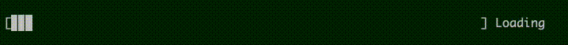
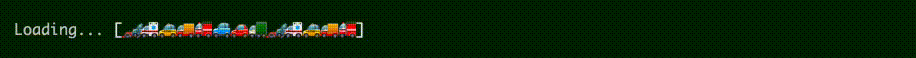
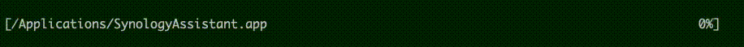
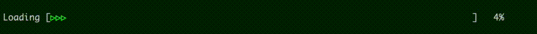
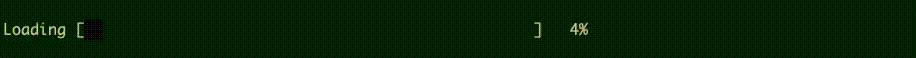
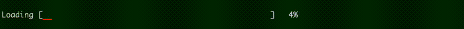
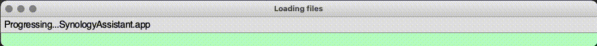
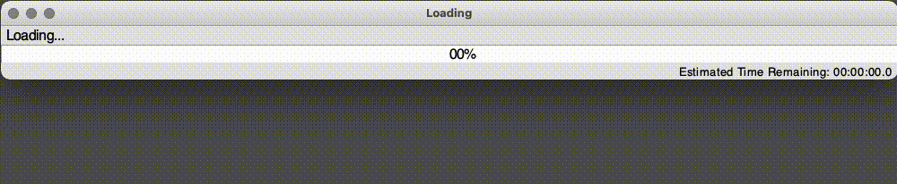

# Progress Bar
Samples of Python code

## progress_bar2.py
Simple command line progress bar. Includes title.  No impcludes necesary, copy, paste and use.

## progress_bar3.py
Simple command line progress bar. Importable function. 

## progress_bar3b.py
Simple command line progress bar. More stylised and more room for title. 

## progress_bar4.py
Simple command line progress bar.  With custom bar and transitional colours.  

## progress_bar5.py
GUI progress bar.  Simple.

## progress_bar6.py
GUI progress bar.  Colour functions.  Percentage.  Predictive time.  Output window.

